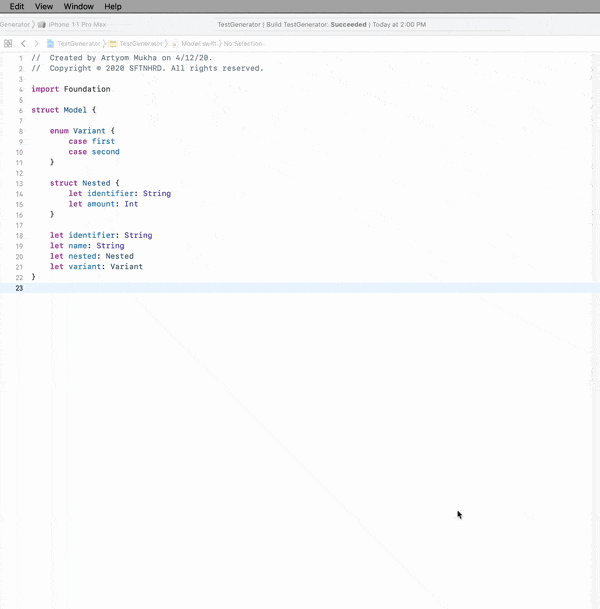

# Sample Generator
Sample — object instance with fake data used for testing.
This Xcode Source Editor Extension will generate Swift samples based on object declarations.
Handy if you have a rather complex model type with nested structs and you have to write a lot of boilerplate code.

## Usage
Open a file with models that should have samples
```swift
struct Model {

    enum Variant {
        case first
        case second
    }

    struct Nested {
        let identifier: String
        let amount: Int
    }

    let identifier: String
    let name: String
    let nested: Nested
    let variant: Variant
}
```

Run the extension's `Generate` and all the samples will be generated. All you need now is to fill samples with default values



## Installation
1. Open `SampleGenerator.xcodeproj`
2. Enable target signing for both the Application and the Source Editor Extension using your own developer ID
3. Product > Archive
4. Right click archive > Show in Finder
5. Right click archive > Show Package Contents
6. Drag `SampleGenerator.app` to your Applications folder
7. Run `SampleGenerator.app`
8. Go to System Preferences -> Extensions -> Xcode Source Editor and enable the extension
9. The menu item should now be available from Xcode's Editor menu
